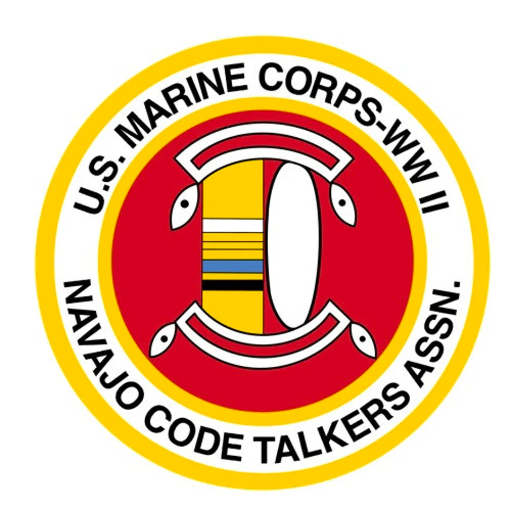

Navajo Code Talkers
********************************************************************************

The `Navajo Code Talkers <https://en.wikipedia.org/wiki/Code_talker>`_ were a group of Navajo members of the U.S. Marine Corps during World War II who used the Navajo language to quickly communicate encoded messages in the Pacific theater.
Content related to Navajo Code Talkers was `removed from DoD websites <https://www.theguardian.com/us-news/2025/mar/18/native-american-code-talkers-dei-military>`_ in accordance with a purge of all diversity related content.

Materials
--------------------------------------------------------------------------------

- `Navajo Code Talkers of World War II (2018 documentary) <https://www.youtube.com/watch?v=OALBG9Rb5cc>`_

- `Unsung Heroes of World War II The Story of the Navajo Code Talkers (1998 book) <https://archive.org/details/unsungheroesofwo0000durr>`_

Assignment
--------------------------------------------------------------------------------

Two ways to learn about the Navajo Code Talkers are given above.
The 2002 movie Windtalkers is `one of the most inaccurate military movies <https://screenrant.com/war-movies-experts-criticized-military-mistakes/>`_ and should not be consulted as a source.
Select at least one of the sources given above, or an alternative source.
If you are unfamiliar with the Code Talkers, consider reading the Wikipedia article given above before watching the documentary.
On the social media platform of your choice, make a post or series of posts answering the following questions:

1. What are your overall impressions from the stories?
What sticks with you the most strongly?

2. The initial reluctance of several of the Code Talkers to return to battlefields in the documentary highlights an important issue.
Discuss the importance of understanding and adapting to cultural practices and religious beliefs for people you're supporting.

3. A common theme in the personal stories of the Code Talkers is the hardships they faced growing up due to the actions of the U.S. government.
Discuss what it might feel like for you to sign up to serve in the U.S. military after growing up with the sort of adversity faced by the Code Talkers and given the history between indigenous people and the U.S. military.

Bonus: It is rather difficult to locate resources on the contributions of indigenous people, even when compared to other systemically marginalized groups.
The video resource for this lesson was a documentary instead of a major motion picture, for example.
Investigate this issue.
